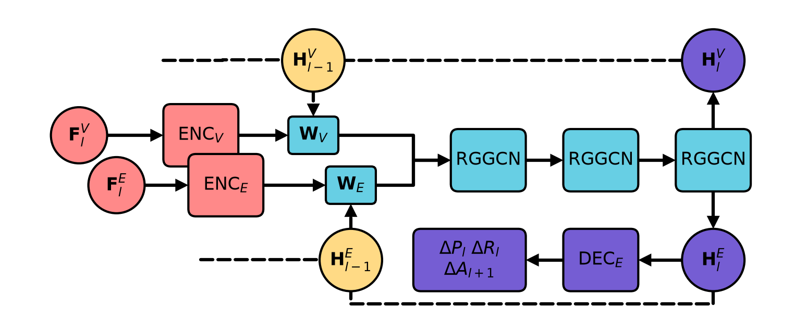

<div align="center">
  

  <h1>Plotio</h1>

  <p><strong>Render Draw.io diagrams as native Matplotlib artists: no rasterization, no seams.</strong></p>

  <p>
    
    
    
    <a href="LICENSE"></a>
  </p>

  <p><sub>🎨 That logo above? Drawn in Draw.io, rendered by Plotio. Nothing was exported to a PNG in the making of it.</sub></p>
</div>

## 🤔 Why

Diagram next to a plot, the usual way: export a PNG from Draw.io, paste it in, fight mismatched fonts and DPI forever. Plotio skips the export step: it parses `.drawio` XML straight into Matplotlib artists, so the diagram lives on the same `Axes`, ships in the same vector file, and can be restyled from your own data at render time.

<div align="center">
  
  <p><sub>Same <code>.drawio</code> file, colored by a <code>graph_layer</code> attribute on each cell via <code>RenderConfig</code>, no editing the diagram itself.</sub></p>
  <p><sub>Diagram from <a href="https://arxiv.org/abs/2605.26854">RAPNet: Accelerating Algebraic Multigrid with Learned Sparse Corrections</a> (ICML 2026).</sub></p>
</div>

## 🎯 Scope

Matplotlib renders shapes, curves, and text differently than Draw.io by nature, so a pixel-perfect match was never really on the table, and that's not the goal. Think of Draw.io as a visual editor for iterating on paper figures rather than as the source of truth for what they'll look like: drag boxes around, wire up edges, get fast feedback, then let Plotio render the version that actually ships. Plotio aims for WYSIWYG wherever that's reasonable, but design the diagram to look right in the rendered output, not in the Draw.io canvas.

## 📦 Install

Not yet published to a package index. Install from source:

```bash
git clone git@github.com:idoby/plotio.git
cd plotio
uv sync
```

## 🚀 Quick start

As a library, render onto an `Axes` you already own. The diagram composes with anything else you draw on it:

```python
import matplotlib.pyplot as plt
from plotio.render import render_drawio

fig, (ax_diagram, ax_plot) = plt.subplots(1, 2, figsize=(10, 4))

render_drawio('architecture.drawio', ax_diagram)
ax_diagram.set_aspect('equal')
ax_diagram.axis('off')

ax_plot.plot(epochs, loss)

fig.savefig('figure.pdf', bbox_inches='tight')
```

Or via the CLI, for a one-shot conversion:

```bash
plotio render architecture.drawio architecture.svg
```

### 🎨 Restyling from data

Give a cell a custom attribute in Draw.io (e.g. `category=encoder`), then override its rendered style at render time without touching the diagram file:

```python
from plotio.render import RenderConfig, render_drawio

config = RenderConfig(
    node_style_overrides={
        'category': {
            'encoder': {'facecolor': '#48cae4'},
            'decoder': {'facecolor': '#ff6b6b'},
        }
    }
)
render_drawio('model.drawio', ax, config=config)
```

Overrides win over styles baked into the `.drawio` file, which in turn win over Plotio's default theme.

## ✅ Supported subset

- **Shapes:** rectangle, rounded rectangle, ellipse, step, plain text labels
- **Edges:** straight and orthogonal routing, explicit waypoints, Catmull-Rom curved edges, fixed and relative (`exitX`/`exitY`/`entryX`/`entryY`) connection points, start/end arrowheads
- **Labels:** node labels and edge labels, with Draw.io's alignment/spacing model and offsets along the edge path
- **Styling:** stroke/fill/font color, stroke width, dashed lines, arc size, all mapped from Draw.io style strings to Matplotlib kwargs through an explicit allowlist
- **Output:** anything Matplotlib can save to (SVG, PDF, PNG, ...), or draw directly onto an `Axes` you control

## 🛠️ Development

```bash
uv run pytest                          # full test suite
uv run pytest tests/test_routing.py    # one file
uv run pytest --cov=plotio             # with coverage

uv run ruff check .                    # lint

uv run mypy src                        # type check
uv run pyright src                     # type check (second checker)
```

Golden-file fixtures for rendering tests live in `tests/data/golden/`.
